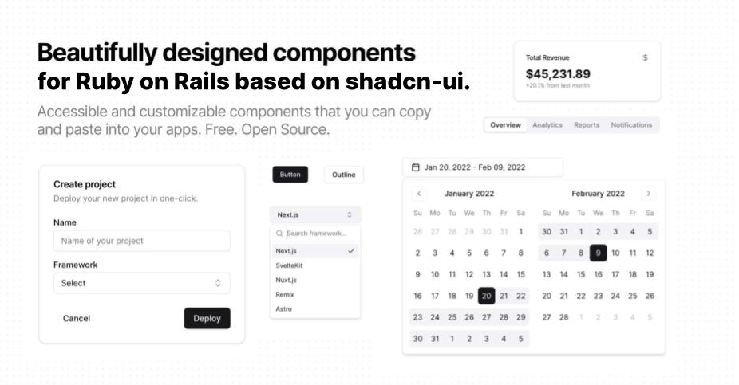

# shadcn/ui on Rails

Accessible and customizable components that you can copy and paste into your apps. Free. Open
Source. **Use this to build your own component library**.

## Documentation

Visit https://avi.nyc/shadcn-on-rails to view the documentation.

## Contributing

I am desperately seeking contributors to this project as it is in the very early stages.

### Contributing with Issues

I am looking for people to start documenting issues in the project. The issues I'm interested in
are:

1. What components are missing? Just start listing out the components that have yet to be
   implemented, better yet, open a PR with a branch for that issue and we can all start adding to
   it.
2. What components are not accessible? I am not an accessibility expert, so I need help with this.
   If you see something that is not accessible, please open an issue and let me know. This might
   mean the aria labels are hardcoded and not customizable or that the labels are simply missing.
3. What components are not customizable? I am trying to make all components as customizable as
   possible. If you see something that is not customizable, please open an issue and let me know.
   All the attributes of a component, like aria labels or classes or id or name, etc, should be
   customizeable by passing attributes into their helper functions that are passed down to the
   component's partial to be rendered.
4. Suggestions for the API of the components. I am trying to make the API as simple as possible. If
   you have any suggestions for how to make the API simpler, please open an issue and let me know. I
   am open to any and all suggestions.

These are 3 main areas that would make the project easier for people to contribute to. They all make
for great opportunities for someone new to open source to both file the issue and even begin to
slowly implement them.

### Setup

1. Fork and clone the repo.
2. Run `bundle install` to install dependencies, there aren't many as this is currently a standard
   Rails applications.
3. `/bin/dev` to start the application.

### App Structure

For now this is a standard Rails 7 application using propshaft and **importmaps**. This will soon be
extracted into a gem that provides the components to be installed (copied) into the including
application.

### Components

The goal of this project is to provide a set of components that can be copied into your application.
The components are built using [TailwindCSS](https://tailwindcss.com/) and
[Stimulus](https://stimulus.hotwire.dev/). Each component follows the same structure:

1. There is a component partial located in `app/views/components/ui` that is rendered by the
   component helper. Ex `app/views/components/ui/_button.html.erb` provides the markup for the
   button component.
2. There is a component helper named after the component that is responsible for rendering the
   component and taking in arguments to customize the component located in `app/helpers/components`.
   Ex `app/helpers/components/button.rb` provides the `render_button` helper that accepts arguments
   such as `variant` which describes the kind of button and passes the classes for that `variant` to
   the partial.
3. When needed there is a stimulus controller for the component that provides the javascript
   required to make the component interactive. Ex. `app/javascript/controllers/toast_controller.js`
   provides the javascript for the toast component to display it and then hide it after a certain
   amount of time.

This demo application also included examples of how to use the components in
`app/views/examples/components`. This is used to create the documentation site that this application
provides with examples of teh components rendered.

For now, this convention should be followed when developing new components.

## `[shadcn-ui](https://ui.shadcn.com)`

These components are based on the components provided by [shadcn/ui](https://ui.shadcn.com). Because
`shadcn-ui` is so heavily reliant on Radix and React, these components are most likely not going to
be 1:1 copies of the components provided by `shadcn-ui`. However, the goal is to provide the same
components with the same API and the same accessibility features. If you are looking for a React
component library, I highly recommend checking out [shadcn/ui](https://ui.shadcn.com).

## License

Licensed under the [MIT license](https://github.com/shadcn/ui/blob/main/LICENSE.md).
